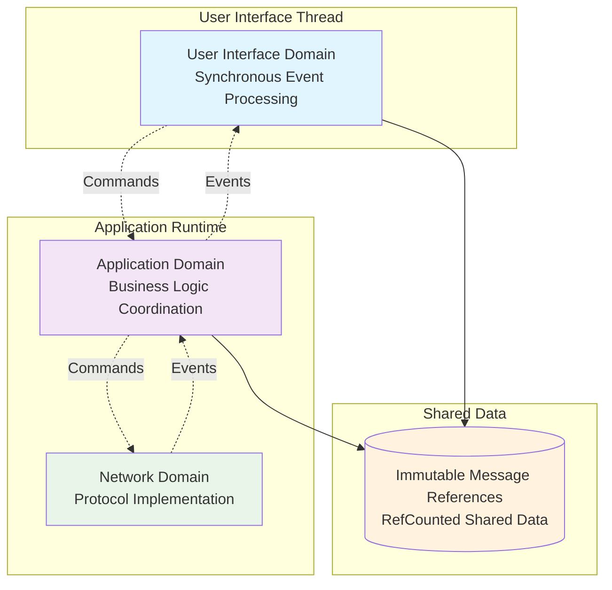

# SREMP Client Architecture Specification

- **Version:** 0.1

## 1. Overview

SREMP clients implement a domain-separated architecture that isolates user interface concerns, application logic, and network operations into independent domains. These domains communicate exclusively through typed message channels while sharing immutable data structures to achieve both safety and efficiency.

The architecture addresses the fundamental challenge of building responsive chat applications that handle large datasets including media content while maintaining end-to-end encryption and preventing deadlock conditions that commonly arise when mixing synchronous user interfaces with asynchronous network operations.

## 2. Architectural Principles

### 2.1 Domain Isolation with Controlled Data Sharing

Each domain operates independently with its own control flow and state management while accessing shared immutable data structures. Domains never share mutable state that requires coordination, eliminating the possibility of cross-domain deadlocks while enabling efficient access to large datasets such as chat histories with embedded media content.

**Calling functions from another domain, or accessing fields from another domain
directly is strictly prohibited.**

### 2.2 Immutable Message-Centric Design

Message content is represented as immutable data structures wrapped in reference-counted containers. This design enables performant sharing of potentially large message content across domain boundaries while ensuring that message data exists only once in memory regardless of how many components reference it. This is possible since messages don't really need to change once sent or arrived, beyond setting a few flags like "received" or "read". For these flags, we make use of interior mutability.

### 2.3 Layered Security Architecture

The client implements three distinct encryption layers that operate at different architectural boundaries. Transport security protects data in transit between any two devices, message security provides end-to-end encryption for traversing networks, and storage security protects data at rest on the local device.

Transport security is handled by the network domain, storage security and
end-to-end encryption are handled by the application domain.

### 2.4 Event-Driven Coordination

Domains coordinate their activities through strongly-typed events and commands sent over message channels. This ensures that all domain interactions are explicit, auditable, and testable while preventing the tight coupling that leads to architectural complexity and deadlock scenarios.

## 3. Domain Architecture

The SREMP client architecture consists of three primary domains that operate concurrently while maintaining clear separation of responsibilities and communication protocols.



### 3.1 User Interface Domain

The User Interface Domain handles all presentation logic and user interaction while operating entirely within the main UI thread using synchronous operations. This domain maintains minimal state focused on immediate display requirements and user interface component management.

The domain receives user input through standard UI framework mechanisms and translates these interactions into application commands sent through message channels. It does not perform business logic operations, cryptographic calculations, or network communications, ensuring that user interface responsiveness is never compromised by expensive operations occurring in other domains.

User interface updates occur in response to events received from the Application Domain through non-blocking message channel operations. The domain processes these events during regular UI refresh cycles, updating display components with new data while maintaining smooth user interaction.

For data access, the User Interface Domain maintains references to shared immutable data structures provided by the Application Domain. This enables immediate access to message content, chat information, and other application data without requiring asynchronous operations or cross-domain coordination during UI rendering.

### 3.2 Application Domain

The Application Domain coordinates all business logic and serves as the authoritative source for application state. This domain handles message encryption and decryption using the Double Ratchet algorithm, manages contact relationships and trust decisions, coordinates data persistence operations, and implements intelligent memory management strategies.

The domain maintains the complete application state including user identity information, active chat conversations, contact databases, and cryptographic state for all ongoing communications. It implements lazy loading strategies to manage memory usage efficiently while ensuring that frequently accessed data remains immediately available.

Message processing in this domain involves receiving encrypted payloads from the Network Domain, performing Double Ratchet decryption to recover plaintext content, creating immutable message data structures, updating relevant chat conversations, and distributing updates to interested domains through event channels.

The Application Domain also coordinates between user actions received from the User Interface Domain and network operations required by the Network Domain. This includes encrypting outgoing messages, managing connection establishment requests, and handling authentication and key exchange operations.

For data persistence, the domain periodically serializes its complete state and encrypts the resulting data for storage on the local device. This approach ensures atomic data consistency while enabling future optimization through incremental saving and lazy loading mechanisms.

### 3.3 Network Domain

The Network Domain implements the SREMP protocols and handles all network communication operations without knowledge of higher-level application semantics. This domain manages TCP connections, performs Noise protocol handshakes for transport security, and handles protocol-level message framing and transmission.

The domain operates with its own connection state management and protocol state machines. It maintains active connections to remote peers, tracks connection health and status, and implements retry and recovery mechanisms for network-level failures.

Communication with the Application Domain occurs through protocol-agnostic interfaces where the Network Domain receives opaque encrypted payloads for transmission and delivers received encrypted payloads without interpreting their content. This separation enables the Network Domain to transport any type of encrypted content while maintaining clean protocol boundaries.

The domain handles connection lifecycle management including initial connection establishment, ongoing connection maintenance, graceful connection termination, and connection failure detection and reporting. It implements the Noise protocol handshake procedure and manages session keys for transport-level encryption.

## 4. Message Architecture and Data Flow

### 4.1 Immutable Message Design

Messages are implemented as immutable data structures that contain all necessary metadata and content while supporting efficient sharing through reference counting mechanisms. The message structure includes plaintext content, media attachments, sender identification, timing information, and delivery status tracking.

```
Message := {
    text: String,
    attachments: MessageAttachments,
    meta: MessageMeta,
    flags: MessageFlags,
}

MessageMeta := {
    author_key: VerifyingKey,
    time_received: DateTime<Utc>,
}

MessageAttachments := {
    pub files: List<List<u8>>,
}

// flags can be changed with read only access from within the same library (not exposed publically)
MessageFlags := {
    received: RefCounted<Mutex<bool>>
    sent: RefCounted<Mutex<bool>>
    read: RefCounted<Mutex<bool>>
}

SharedMessage := RefCounted<Message>
```

Fields that require occasional updates after message creation use interior mutability with minimal locking scope to ensure that updates remain atomic and non-blocking. These updates typically involve status changes such as marking messages as read or updating delivery confirmation information.

The read flag documents if the local user has already read this message. SREMP
does not track whether the receiver of a message has read a sent message.

### 4.2 Chat Data Structures

Chat conversations are represented as collections of shared message references rather than owning message content directly. This design enables efficient chat updates through snapshot creation that only copies message reference collections rather than underlying message content. This is beneficial as the UI domain needs access to the messages stored in chats often, and messages can get large with attached media.

```
Chat := {
    contact_identity: ContactIdentity,
    messages: List<SharedMessage>,
}
```

When new messages arrive or conversation state changes, the Application Domain creates updated chat snapshots containing the modified message collections and emits a `UiEvent`. These snapshots represent consistent point-in-time views of conversation state that can be safely accessed by the UI domain without coordination or locking mechanisms.

## 5. Inter-Domain Communication

### 5.1 Command and Event Protocols

Domain coordination uses strongly-typed command and event protocols that separate operational requests from state change notifications. Commands flow from higher-level domains to lower-level domains requesting specific operations, while events flow upward to notify of state changes and operation results.

The figure below shows theoretical examples of those events and commands, but is
not prescriptive or exhaustive:

```
UICommand := SendMessage { chat_id, content }
          | CreateIdentity { username }
          | LoadChatHistory { chat_id }
          | EstablishConnection { remote_address }

NetworkCommand := ConnectToPeer { remote_address }
                | SendEncryptedPayload { destination, payload }
                | StartListener { bind_address }

NetworkEvent := ConnectionEstablished { peer_address, peer_identity }
              | EncryptedPayloadReceived { source_address, payload }
              | ConnectionFailed { address, error_description }

UIEvent := ChatUpdated { chat_id, snapshot }
         | NewMessage { chat_id, message }
         | IdentityCreated { identity_summary }
         | ConnectionStatusChanged { status }
```

### 5.2 User Interface Data Access Patterns

The User Interface Domain employs several data access patterns to efficiently obtain information from the Application Domain while maintaining responsive user interaction. These patterns address the challenge of providing immediate data access in a message-passing architecture.

For initial application startup, the User Interface Domain sends a startup command and receives a comprehensive state snapshot containing all information necessary for initial display. This includes available chat conversations, user identity information, and connection status.

```
// Application startup sequence
ui_commands.send(ApplicationStartup)
// Response provides complete initial state
UIEvent::InitialState {
    user_identity: Optional<IdentitySummary>,
    available_chats: List<ChatSummary>,
    connection_status: ConnectionStatus,
}
```

When users navigate between different chat conversations, the User Interface Domain requests specific chat data and receives detailed conversation snapshots. The Application Domain responds with complete chat information including message history, contact details, and conversation metadata.

```
// Chat navigation sequence
ui_commands.send(LoadChat { chat_id })
// Response provides complete chat data
UIEvent::ChatLoaded {
    chat_snapshot: Chat, // can be cloned without much cost
}
```

For ongoing conversation updates, the User Interface Domain maintains references to shared chat data and receives incremental update events when changes occur. This hybrid approach combines the efficiency of direct data access with the consistency guarantees of event-driven updates.

The User Interface Domain processes events during regular refresh cycles using non-blocking channel operations that integrate smoothly with UI framework event loops. This ensures that user interface updates occur promptly without blocking user interaction or causing frame rate degradation.

## 6. Security and Encryption Architecture

### 6.1 Layered Encryption Model

SREMP clients implement three distinct encryption layers that operate at different architectural boundaries to provide comprehensive security for data in transit, message content, and stored information.

Transport encryption operates at the Network Domain boundary using the Noise protocol to provide authenticated and confidential communication channels between SREMP clients. This layer ensures that all network traffic is protected against eavesdropping and manipulation while enabling mutual authentication between communicating parties.

Message encryption operates at the Application Domain boundary using the Double Ratchet algorithm to provide end-to-end encryption with forward secrecy and post-compromise security. This layer ensures that message content remains confidential even if transport encryption is compromised or if long-term identity keys are disclosed.

Storage encryption operates at the persistence boundary using symmetric encryption to protect application state stored on local devices. This layer ensures that chat histories, contact information, and cryptographic state remain protected when stored on potentially compromised devices.

### 6.2 Cryptographic State Management

The Application Domain maintains all cryptographic state necessary for secure communication including user identity key pairs, contact public keys, and Double Ratchet session state for ongoing conversations. This state is managed as part of the overall application state and is included in encrypted persistence operations.

Key exchange operations occur during connection establishment when the Network Domain completes Noise handshakes and provides peer identity information to the Application Domain. The Application Domain uses this information to initialize or resume Double Ratchet sessions for ongoing communication with each contact.

Message encryption and decryption operations occur within the Application Domain using maintained Double Ratchet state. Outgoing messages are encrypted before transmission to the Network Domain, while incoming encrypted payloads are decrypted after receipt from the Network Domain.

## 7. Data Persistence and State Management

### 7.1 Unified State Serialization

Application state persistence uses a unified serialization approach where the relevant fields Application Domain state is serialized and encrypted as a single atomic operation. This includes user identity information, chat conversation data, contact databases, and cryptographic state for all active communications.

```
ApplicationState := {
    user_identity: Optional<UserIdentity>,
    conversations: Map<ContactId, SharedChat>,
    contact_database: Map<ContactId, ContactIdentity>,
    ratchet_sessions: Map<ContactId, RatchetState>,
    application_preferences: UserPreferences,
}
```

The serialization process creates a complete snapshot of application state that can be encrypted using a storage key derived from user credentials or device-specific information. This approach ensures that persistence operations are atomic, and that application state remains consistent across save and load operations.

**Unclear:** How should UI Preferences be stored?

### 7.2 Memory Management Strategy

The Application Domain implements intelligent memory management to handle large conversation histories and media content efficiently. Active conversations and recently accessed chats remain fully loaded in memory for immediate access, while historical data can be loaded on demand from persistent storage.

Reference counting mechanisms ensure that shared message data is automatically deallocated when no longer needed by any domain. Large media attachments are shared efficiently across all references without duplication, and memory usage remains bounded regardless of total conversation history size.

The lazy loading strategy can be implemented transparently by extending the current architecture to request historical data from storage when users navigate to older conversations or search through message history. This maintains the current architectural benefits while enabling efficient handling of arbitrarily large datasets.

### 7.3 Storage Security

Stored application state is encrypted using symmetric encryption with keys derived from user authentication information or device-specific credentials. This ensures that stored conversation data, contact information, and cryptographic material remain protected even if storage media is compromised.

The storage key derivation process can incorporate user passwords, device hardware identifiers, or biometric authentication data to provide appropriate security levels for different deployment scenarios. Key derivation uses standard cryptographic hash functions to ensure that storage keys cannot be recovered without proper authentication credentials.

## 8. Error Handling and Resilience

### 8.1 Domain Error Isolation

Each domain handles errors appropriate to its responsibility level while communicating error conditions to other domains through well-defined event protocols. Network errors are handled within the Network Domain with retry and recovery mechanisms, while application-level errors are managed by the Application Domain and communicated to users through User Interface Domain events.

Cross-domain error communication uses typed error events that provide sufficient information for appropriate error handling without exposing internal implementation details. This enables proper error recovery and user notification while maintaining clean architectural boundaries.

### 8.2 State Consistency and Recovery

The unified state serialization approach ensures that application state remains consistent even in the presence of unexpected failures or shutdown conditions. Since persistence operations are atomic, the application can always recover to a known consistent state when restarting after failures.

Message delivery and receipt operations are designed to be idempotent where possible, enabling safe retry of operations that may have been interrupted by network failures or application restarts. Double Ratchet session state is managed to ensure that cryptographic state remains synchronized even when individual messages are lost or duplicated.

## 9. Testing and Validation

### 9.1 Domain Isolation Testing

Each domain can be tested independently by providing mock implementations of communication channels and shared data structures. This enables comprehensive testing of domain-specific logic without requiring integration of the complete system.

User Interface Domain testing focuses on presentation logic and user interaction handling using mock event streams and command verification. Application Domain testing emphasizes business logic correctness and cryptographic operation validation using controlled input scenarios. Network Domain testing validates protocol implementation and network error handling using simulated network conditions.

### 9.2 Integration Testing

Complete system testing validates that all domains work together correctly to provide expected user-visible behavior. These tests exercise complete message flows from user input through network transmission to recipient display, ensuring that the domain separation does not impact functional correctness.

Integration tests also validate performance characteristics including memory usage patterns, message delivery latency, and user interface responsiveness under various load conditions. The shared message architecture should demonstrate efficient memory usage even with large media content and extensive conversation histories.

### 9.3 Security Validation

Security testing validates that the layered encryption model provides appropriate protection at each architectural boundary. This includes verifying that transport encryption properly protects network traffic, that message encryption provides end-to-end security, and that storage encryption protects persistent data.

Cryptographic testing validates that Double Ratchet implementations provide expected forward secrecy and post-compromise security properties. Protocol testing ensures that key exchange operations complete successfully and that message ordering and delivery guarantees are maintained even under adverse network conditions.

## 10. Performance Characteristics

### 10.1 Memory Usage Patterns

The shared message architecture provides predictable memory usage characteristics where message content is allocated once and shared efficiently across all references. Memory usage scales with the number of unique messages rather than the number of references to those messages.

Large media attachments benefit significantly from the shared architecture since video files, images, and other large content remain in memory only once regardless of how many display components or domains reference them. This enables efficient handling of media-rich conversations without excessive memory consumption.

The lazy loading strategy provides bounded memory usage even with arbitrarily large conversation histories. Active conversations remain in memory for immediate access while historical data is loaded on demand, enabling responsive user interaction regardless of total data volume.

### 10.2 Communication Efficiency

Inter-domain communication focuses on lightweight notifications and command messages rather than bulk data transfer. Message content sharing occurs through reference passing rather than content copying, ensuring that communication overhead remains minimal even for large datasets.

Event processing in the User Interface Domain occurs during regular refresh cycles using non-blocking operations that integrate efficiently with UI framework event loops. This ensures that user interface updates occur smoothly without impacting user interaction responsiveness.

Network communication efficiency benefits from the clean separation between protocol implementation and application logic. The Network Domain can optimize protocol-level operations without impacting higher-level application functionality, while the Application Domain can implement efficient message batching and prioritization strategies.
