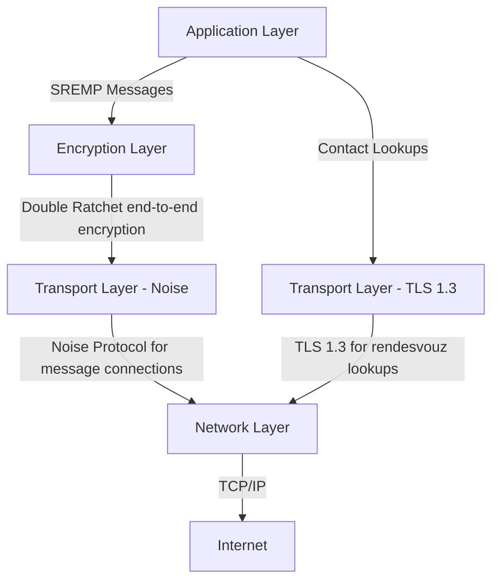
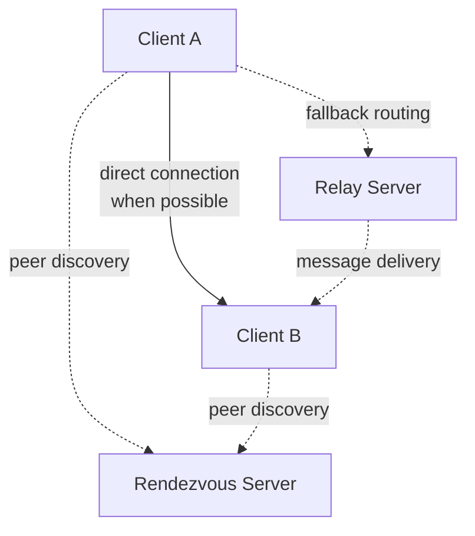

# SREMP Specification

- **Version 0.1-draft**
- **Status: In Development**

## Abstract

The Secure Relay-Enhanced Messaging Platform (SREMP) defines a decentralized peer-to-peer messaging system that separates peer discovery from message routing and storage. The platform enables secure communication through direct connections when possible, with graceful fallback to relay-based routing when direct connectivity is unavailable.

## 1. Introduction

SREMP provides a messaging platform where users maintain control over their infrastructure choices while ensuring end-to-end security. The platform disaggregates traditional messaging server functions into specialized components: rendezvous servers handle peer discovery, relay servers provide message routing and temporary storage, and clients maintain long-term message history and user interfaces.

### 1.1 Terminology

This document uses a mix of ABNF-like (RFC 5234) notation and Rust-like Pseudocode for structured definitions. Platform messages are defined using a simplified notation where:

- `Name := { field: type, field: type }` defines structured data
- `Name := VALUE1 | VALUE2` defines enumerated types
- `Vec<Type>` represents arrays of the specified type
- `Optional<Type>` represents nullable fields
- `DateTime<TZ>` represents a time and date in the time zone `TZ`

We define this structure in the [Notation specification](./notation.md).

### 1.2 Design Principles

The platform prioritizes user autonomy over operational simplicity. Users can operate purely peer-to-peer, use third-party infrastructure, or deploy their own services as needed. All message content remains encrypted end-to-end regardless of routing path.

## 2. Architecture Overview

### 2.1 Platform Stack

SREMP operates over TCP/IP with two distinct transport security layers depending on the communication type:



### 2.2 Component Roles

The SREMP network comprises three component types with distinct responsibilities:

**Clients** generate, display, and persistently store messages for users. Clients maintain the complete message history and handle all cryptographic operations for their users. Each client may optionally provide relay functionality for itself or others.

**Rendezvous Servers** facilitate peer discovery by maintaining registries of online peers and their network locations. These servers coordinate initial connection establishment but do not handle message content or routing.

**Relay Servers** provide message routing and temporary storage for asynchronous delivery. Relays store encrypted message blobs when recipients are offline and forward messages between peers who cannot establish direct connections.

**Architecture Note**: Clients include relay server functionality as a code reuse measure, similar to Minecraft's integrated server feature. The built-in relay serves only the local user's message storage and synchronization needs, avoiding code duplication between client and relay implementations.

### 2.3 Component Interaction



## 3. Identity and Authentication

### 3.1 Identity Structure

Each SREMP participant possesses a cryptographic identity consisting of an Ed25519 key pair and associated metadata:

```
Identity := {
    username: String
    public_key: Ed25519PublicKey,
    flags: Flags,
    extensions: Optional<Extensions>
}

Flags := {
    uses_relay: Boolean,
    is_machine_account: Boolean,
    is_relay_server: Boolean,
    prefers_async: Boolean
}

Extensions := {
    profile_picture: Optional<Vec<u8>>,
    additional_metadata: Optional<Map<String, Vec<u8>>>
}

UserIdentity := {
    identity: Identity,
    private_key: Ed25519PrivateKey,
    created: DateTime<Utc>
}

ContactIdentity {
    identity: Identity,
    trust: Trust,
    first_seen: DateTime<Utc>,
    last_seen: DateTime<Utc>
}

Trust := Unknown | Trusted | Rejected

Username := String(1..=40)
```

The public key serves as the canonical identifier for routing purposes and cannot be changed without creating an entirely new identity. The username provides human-readable identification, and the version field enables future identity format evolution. Extensions allow future platform versions to include additional metadata such as profile pictures.

A Username should be a UTF-8 String with 1 to 40 characters.

### 3.2 Trust Model

SREMP employs Trust-on-First-Use (TOFU) authentication similar to SSH. Clients cache identity mappings on first contact and treat each Ed25519 public key as representing a permanent identity. Users who wish to change their cryptographic keys must create an entirely new identity and re-establish trust relationships.

Trust states represent the user's assessment of a contact's authenticity:

- **Unknown**: Default state for new contacts using TOFU
- **Trusted**: Manually verified through out-of-band channels (or just
  accepted as good enough)
- **Rejected**: Manually marked as untrusted or potentially malicious

**Security Consideration**: TOFU provides limited protection against sophisticated man-in-the-middle attacks during initial key exchange. Users requiring stronger authentication must verify identity keys through out-of-band channels.

## 4. Transport Security

### 4.1 Peer-to-Peer Communications

All peer-to-peer communications use the Noise Protocol Framework with the XX handshake pattern:

```
Noise_XX_25519_ChaChaPoly_Blake2s
```

The Noise static keys correspond directly to SREMP Ed25519 identity keys, providing mutual authentication during handshake completion. Each connection establishes fresh ephemeral keys to ensure forward secrecy.

**Protocol Uncertainty**: The Noise message framing and any additional SREMP-specific prologue data require detailed specification.

### 4.2 Rendezvous Communications

Client connections to rendezvous servers use standard TLS 1.3 with server certificate validation. This choice introduces dependency on the traditional PKI system but simplifies deployment and debugging since rendezvous communications contain no secret data.

**Design Trade-off**: Using Noise for rendezvous communications would eliminate PKI dependency but requires additional infrastructure for rendezvous server authentication.

## 5. Message Encryption

SREMP provides layered encryption with both transport-level and message-level protection:

**Transport Encryption** through Noise provides session-level forward secrecy and prevents network attackers from observing message content or metadata.

**Message Encryption** through the Double Ratchet algorithm provides per-message forward secrecy and post-compromise security. Each message uses a unique ephemeral key that is immediately deleted after encryption, and the key derivation state evolves continuously to provide self-healing properties.

The Double Ratchet operates end-to-end between clients, with relay servers storing and forwarding encrypted message blobs without any ability to decrypt content.

## 6. Connection Establishment

SREMP clients can establish connections through multiple methods without requiring centralized infrastructure:

**Direct Connection Sharing**: Users can exchange connection information directly through QR codes, manual address sharing, or other out-of-band methods. This eliminates dependence on rendezvous servers for users who prefer direct coordination.

**Rendezvous-Assisted Discovery**: When available, rendezvous servers facilitate peer discovery by maintaining registries of online users. Clients can browse available contacts or search for specific identities.

**Direct Connection**: Clients attempt TCP connections to peer addresses obtained through any discovery method. This provides optimal latency and privacy when both peers have reachable network addresses.

**Relay-Mediated Connection**: When direct connection fails, clients establish Noise connections to relay servers, which forward encrypted messages between endpoints. Relays cannot decrypt message content but observe metadata including sender, recipient, and timing information.

**Integrated Relay Functionality**: Clients include built-in relay server functionality to avoid code duplication and provide always-on message storage for the local user. This internal relay serves only the local client and is not advertised to other users.

**Specification Gap**: The exact decision logic for connection method selection and fallback timing requires detailed specification.

## 7. Peer Discovery Protocol

**Protocol Status**: The following protocol definitions are preliminary and require validation through implementation.

Rendezvous servers maintain registries of online peers and respond to discovery queries. The protocol operates over TLS connections with simple request-response message exchanges.

### 7.1 Peer Registration

Clients register their current network location with rendezvous servers to enable discovery by other peers. Registration expires automatically and requires periodic renewal to maintain online status:

```
REGISTER_REQUEST := {
    identity: Identity,
    endpoint: DNSEndpoint,
    ttl_seconds: u32,
    signature: Ed25519Signature
}

REGISTER_RESPONSE := {
    success: Boolean,
    expires_at: Timestamp,
    renewal_interval: u32,
    error_message: Optional<String>
}
```

Rendezvous servers track peer online status through registration expiry and optional heartbeat mechanisms. The signature prevents unauthorized registration using another party's identity.

### 7.2 Peer Lookup

Clients query rendezvous servers to discover specific peers or browse available contacts:

```
LOOKUP_REQUEST := {
    target_identity: Optional<Ed25519PublicKey>,
    list_all: Boolean
}

LOOKUP_RESPONSE := {
    peers: Vec<PeerInfo>,
    error_message: Optional<String>
}

PeerInfo := {
    identity: Identity,
    endpoint: DNSEndpoint,
    last_seen: Timestamp,
    online: Boolean
}

DNSEndpoint := {
    host: DNSName | IPAddress,
    port: u16
}
```

When `target_identity` is specified, the response contains at most one peer. When `list_all` is true, the response contains all currently registered peers, enabling contact discovery.

### 7.3 Server Discovery

Clients discover additional rendezvous servers through gossip protocols:

```
LIST_SERVERS_REQUEST := {}

LIST_SERVERS_RESPONSE := {
    servers: Vec<SocketAddr>,
    timestamp: Timestamp
}
```

## 8. Message Storage and Relay Protocol

**Protocol Status**: These protocol definitions require significant development and validation.

Relay servers provide message routing and temporary storage through Noise-encrypted connections. Relays authenticate clients using their SREMP identities but cannot decrypt message content.

### 8.1 Relay Registration

Clients authenticate with relay servers using their identity keys:

```
RELAY_REGISTER := {
    identity: Ed25519PublicKey,
    auth_signature: Ed25519Signature,
    capabilities: RelayCapabilities
}

RelayCapabilities := {
    max_message_size: u32,
    max_storage_duration: Duration
}
```

### 8.2 Message Storage and Delivery

Clients store encrypted messages for offline recipients and track delivery status through confirmation mechanisms:

```
STORE_MESSAGE := {
    recipient: Ed25519PublicKey,
    encrypted_blob: Vec<u8>,
    sender_signature: Ed25519Signature,
    message_id: MessageId
}

STORE_RESPONSE := {
    success: Boolean,
    stored_at: Timestamp,
    message_id: MessageId
}

RETRIEVE_MESSAGES := {
    identity: Ed25519PublicKey,
    auth_signature: Ed25519Signature,
    since: Optional<Timestamp>
}

MESSAGE_BATCH := {
    messages: Vec<StoredMessage>,
    has_more: Boolean
}

StoredMessage := {
    message_id: MessageId,
    sender: Ed25519PublicKey,
    timestamp: Timestamp,
    encrypted_blob: Vec<u8>
}

DELIVERY_CONFIRMATION := {
    message_id: MessageId,
    delivered_to: Ed25519PublicKey,
    timestamp: Timestamp,
    signature: Ed25519Signature
}
```

Relay servers must track message delivery status and route confirmation messages back to original senders. This requires maintaining routing information to locate sender relays or direct connections.

## 9. Threat Model and Security Analysis

### 9.1 Attacker Capabilities

**Network Attackers** can observe, modify, or block network traffic but cannot compromise endpoint devices or obtain private keys. The Noise transport encryption prevents content access, but traffic analysis may reveal communication patterns.

**Malicious Infrastructure** includes compromised or adversarial rendezvous and relay servers. Such servers can disrupt service, log metadata, and perform traffic analysis but cannot decrypt message content due to end-to-end encryption.

**Endpoint Compromise** represents attackers who gain access to client devices or private keys. This represents complete compromise of the affected user's security, as all message content and cryptographic material becomes accessible.

**Global Passive Adversaries** can monitor all network traffic across multiple network segments. While message content remains protected, such adversaries can perform comprehensive traffic analysis to infer communication patterns and social relationships.

### 9.2 Security Properties

**Confidentiality** protects message content from all parties except intended recipients through layered encryption. Transport encryption prevents network observation while message-level encryption ensures relay servers cannot access content.

**Authenticity** ensures message origin verification through Ed25519 signatures integrated into the Double Ratchet algorithm. Recipients can verify both message content integrity and sender identity.

**Forward Secrecy** provides protection against future key compromise through both session-level (Noise ephemeral keys) and message-level (Double Ratchet) mechanisms. Past messages remain secure even if current keys are compromised.

**Post-Compromise Security** enables automatic recovery from partial key compromise through Double Ratchet key evolution. The protocol self-heals when new Diffie-Hellman exchanges introduce fresh entropy into the key derivation process.

### 9.3 Metadata Exposure

Different communication paths provide varying levels of metadata protection:

**Direct peer-to-peer connections** expose only network-level metadata to internet service providers and network operators. No third parties observe SREMP-specific metadata.

**Relay-mediated connections** expose sender, recipient, timing, and message size information to relay operators. This metadata enables traffic analysis and social graph inference.

**Rendezvous-assisted discovery** exposes peer lookup patterns and social connections to rendezvous server operators. Frequent lookup patterns may reveal communication intentions.

## 10. Implementation Considerations

### 10.1 Message Serialization

All messages use MessagePack binary serialization for efficiency and implementation simplicity. Text content uses UTF-8 encoding, and numeric values follow little-endian byte order conventions.

### 10.2 Protocol Versioning

SREMP connections begin with a simple version announcement as the first transmitted data. Each peer sends a version header before any other protocol data:

```
VERSION_HEADER := {
    protocol_name: "SREMP",
    version_major: u8,
    version_minor: u8
}
```

For the initial protocol implementation, all connections use version 1.0. Future protocol versions can implement more sophisticated negotiation mechanisms as needed, using the version header to determine appropriate behavior.

**Implementation Note**: The version header is transmitted before Noise handshake initiation to enable protocol-level compatibility checking.

### 10.3 Message Chunking

The Noise Protocol Framework limits individual transport messages to 65535 bytes (2^16 - 1). SREMP applications must fragment larger messages across multiple Noise frames:

```
CHUNK_HEADER := {
    message_id: MessageId,
    chunk_index: u16,
    total_chunks: u16,
    chunk_size: u16
}

CHUNKED_MESSAGE := {
    header: CHUNK_HEADER,
    payload: Vec<u8>
}
```

Receiving applications reassemble chunked messages using the message_id and chunk_index fields. Applications must implement appropriate buffering and timeout mechanisms to handle incomplete or out-of-order chunk delivery.

### 10.4 Error Handling

The platform must define consistent error handling and recovery mechanisms for various failure scenarios including network connectivity loss, server unavailability, and protocol version mismatches.

**Specification Gap**: Comprehensive error condition enumeration and recovery procedures remain unspecified.

## 11. Operational Considerations

### 11.1 Resource Management

Relay servers require policies for message storage limits, retention periods, and client authentication to prevent abuse and ensure sustainable operation. These policies must balance availability against resource consumption.

### 11.2 Network Address Translation

Many clients operate behind Network Address Translation (NAT) devices that prevent direct connectivity. While SREMP can operate purely through relay servers in such environments, future versions may include NAT traversal techniques.

### 11.3 Bootstrap Discovery

New clients require initial rendezvous server addresses to begin peer discovery. The platform should specify multiple bootstrap mechanisms including hardcoded addresses, DNS-based discovery, and manual configuration.

## 12. Future Considerations

This specification describes SREMP but acknowledges several areas requiring future development:

**Group Messaging** protocols for multi-party communication with appropriate key management and member authentication mechanisms.

**File Transfer** capabilities for large content sharing with resumption support and integrity verification.

**Anonymous Communication** through onion routing or similar techniques to enhance metadata privacy.

**Federation** protocols enabling communication across independently operated infrastructure domains.

## 13. Acknowledgments

This platform draws inspiration from the Signal Protocol, the Noise Protocol Framework, and various decentralized communication systems. The specification reflects ongoing design discussions and implementation experience.

# Appendix

## A Constants

- `DHLEN := 32`: Diffie-Hellman output length (32 bytes for Ed25519)
- `MAX_FRAME_SIZE := 65535`: Maximum transport frame size (65535 bytes)

`MAX_FRAME_SIZE` may become smaller. It is not yet determined if the Noise
Protocol Framework provides a smaller window, or how large the headers for our
protocols are.

---

**Document Status**: This specification is under active development. Protocol definitions, security analysis, and implementation requirements will be refined through practical implementation and security review.
